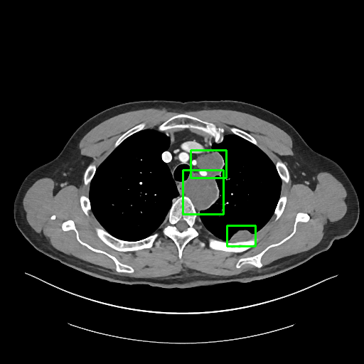
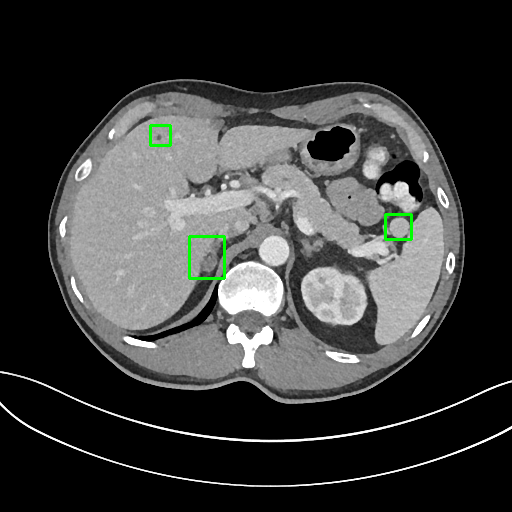
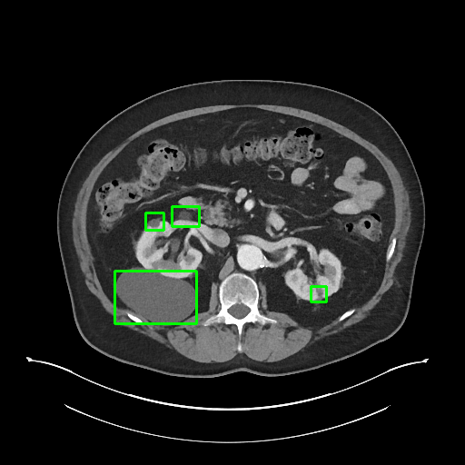

##Manual Lesion Annotations of DeepLesion
This repository contains annotations and evaluation code for the paper “Learning from Multiple Datasets with Heterogeneous and Partial Labels for Universal Lesion Detection in CT” in IEEE Trans. Med. Imaging, 2020 ([arXiv](https://arxiv.org/abs/2009.02577)).

DeepLesion [1,2] is a large-scale CT dataset including 32,735 lesion annotations in a variety of organs.
It is a great resource for training a universal lesion detector [1,3].

However, the annotations in DeepLesion are incomplete.
Not all lesions in each CT were annotated. In addition, each 3D lesion was only annotated in a 2D key slice.
This will bias the evaluation accuracy.

To solve this problem, we invited a board certified radiologist to manually label the 3D bounding-box of every lesion in 1000 CT sub-volumes.
The sub-volumes were randomly selected from the test set of DeepLesion.
There are 5,447 lesions in 43,295 axial slices of 618 patients in total.
The 1K sub-volumes were split into 200 for validation and 800 for testing with no patient-level overlap.
We hope this 3D fully-annotated test set can facilitate the development and evaluation of universal lesion detection.

Sample annotations:
  

To deal with the missing annotations in the training set of DeepLesion, you can also refer to the lesion mining algorithms in [3,4].
### Usage
The annotations are in `DeepLesion_manual_1K_test_release.pkl`. 
It is a dict in the format of `annotation[fn] = B`, 
where `fn` is the name of the sub-volume, `B` is an n-by-6 numpy array, `n` is the number of 3D boxes in the sub-volume.
Each row of `B` is a 3D box in the format of `[x1, y1, z1, x2, y2, z2]`.

Sub-volumes: You can use `DL_save_nifti.py` to group the DeepLesion dataset into sub-volumes.
The name format of a sub-volume is "{volume_name}_{top slice index}-{bottom slice index}".

We also provide the evaluation code in our paper [3] to compute the average sensitivity on the FROC curve.
Please see `evaluation_sample.py` for details.

### References
[1] Ke Yan, Xiaosong Wang, Le Lu, Ronald M. Summers, “DeepLesion: automated mining of large-scale lesion annotations and universal lesion detection with deep learning,” J. Med. Imaging, vol. 5, no. 3, p. 1, 2018.   
[2] Ke Yan, Xiaosong Wang, Le Lu, Ling Zhang, Adam P. Harrison Mohammadhadi Bagheri, Ronald M. Summers, “Deep Lesion Graphs in the Wild: Relationship Learning and Organization of Significant Radiology Image Findings in a Diverse Large-scale Lesion Database,” in CVPR, 2018.  
[3] Ke Yan, Jinzheng Cai, Youjing Zheng, Adam P. Harrison, Dakai Jin, You-Bao Tang, Yu-Xing Tang, Lingyun Huang, Jing Xiao, Le Lu, “Learning from Multiple Datasets with Heterogeneous and Partial Labels for Universal Lesion Detection in CT,” IEEE Trans. Med. Imaging, 2020.
[4] Jinzheng Cai et al., “Lesion harvester: Iteratively mining unlabeled lesions and hard-negative examples at scale,” IEEE Trans. Med. Imaging, Jan. 2020.